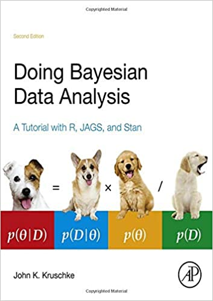
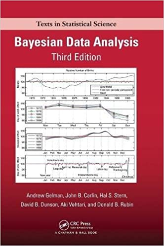

```{r setup, include=FALSE}
# Licenza afl-3.0

library(fontawesome)
library(knitr)
library(DT)
library(HDInterval)
library(bayesplot)
knitr::opts_chunk$set(echo = FALSE)
```

## Table of topics

> 1. **OMG! What is going to happen?** <br>
> 2. Bayesian Parameter Estimation <br>
> 3. Bayesian Model Selection <br>
> 4. Bayesian Model Prediction <br>
> 5. Bayesian Model Diagnostics <br>
> 6. Final Suggestions and Recommended Books


## 1. OMG! What is going to happen?


<table>
<tr>
<td style="vertical-align:top">

</td>
<td>
- Theoretical introduction
- 
- 
- BFDA
  
</td>
</tr>
</table>


## OMG! What is going to happen?


<table>
<tr>
<td style="vertical-align:top">

</td>
<td>
- The origins: Bayes & Laplace
- $P(\theta|D) \propto P(D|\theta) \times P(\theta)$
- Prior distribution $P(\theta)$ or $P(H)$:

  <blockquote>
    probability distribution concerning the hypothesis or parameters in terms of data distribution. <br>
    _How I believe the data will be distributed._
  </blockquote>
  
- Likelihood function $P(D|\theta)$ or $P(D|H)$:
  
  <blockquote>
    probability distribution of the data giving the model. <br>
    _How data are really distributed giving the model._
  </blockquote>
  
- Posterior distribution $P(\theta|D)$ or $P(H|D)$:

  <blockquote>
  Probability distribution of the hypothesis or the parameters after the observation of the data. <br>
    _Trade-off between my expectation and the observed data._
  </blockquote>
  
</td>
</tr>
</table>
   

## Why use it?


- Reliability [@Etz2016; @Gelman2006]

- Accuracy (small data and noisy data, but also complex models)
  [@Kruschke2012; @Scandola2021; @scandola2024reliability; @scandola2025bayesianreliability]

- Introducing previous knowledge
  [@Kruschke2012; @Andrews2013]

- In the Bayesian context, probability has a direct interpretation
  [@Kruschke2010; @Wagenmakers2018]

- Testing the null hypothesis ($H_0$)


  
## Summarizing concepts...

<div class="box" style="margin-left:5%;font-size:80%;">
- **What are my beliefs?**

- A-priori distribution.
- I believe there is a difference (effect size).
- No hypothesis, non-informative of slightly informative prior.
  
* *Graphical representation of prior distributions!*
</div>

<div class="box" style="margin-left:37%;margin-top:5%;font-size:80%;">
- **What I observe?**

- Likelihood function.
- Data are modifying the parameters of your model
  ($\beta$s)
</div>

<div class="box" style="margin-left:70%;margin-top:10%;font-size:80%;">
- **Does my belief change, after my observations?**

- Posterior distribution.
- Bayes Factor (a sort of "weighted mean" between my a-priori and the observations)
- other techniques...
</div>


## Different concept of probability

<table class="tg">
<thead>
  <tr>
    <th class="tg-fymr">**Frequentist**</th>
    <th class="tg-fymr">**Bayesian**</th>
  </tr>
</thead>   
<tbody>
  <tr>
    <td class="tg-0pky1">
      - parameters are fixed, data are random sampled
    </td>
    <td class="tg-0pky2">
      - data are fixed (true), parameters are variable
    </td>
  </tr>
  <tr>
    <td class="tg-0pky1">
      - null-hypothesis assumption
    </td>
    <td class="tg-0pky2">
      - each hypothesis can have a different probability
    </td>
  </tr>
  <tr>
    <td class="tg-0pky1">
      - p-value ($P_\theta(X = x)$) <br>
        represents the "rarity"
        represents how rare it is to obtain the observed sample<br>
        from a statistical population under $H_0$
    </td>
    <td class="tg-0pky2">
      - probability represents the credibility that a certain hypothesis<br>
        or certain parameters of the distributions have <br>
        *that is, it represents the uncertainty towards a hypothesis or parameter*
    </td>
  </tr>
  
  <tr>
    <td class="tg-0pky1">
      - the 95% _confidence_ interval indicates<br>
      that the true sample mean is in<br>
      the 95% of the time
    </td>
    <td class="tg-0pky2">
      - the 95% _credibility_ interval or HDI<br>
        indicates that the 95% of statistical population<br>
        is within the CI
    </td>
  </tr>
</tbody>
</table>


## Different methodologies for different goals

<center>
{width=30% height=30%}
</center>
<hr>

<table class="tg">
<thead>
  <tr>
    <th class="tg-fymr">Task</th>
    <th class="tg-fymr">Method</th>
  </tr>
</thead>   
<tbody>
  <tr>
    <td class="tg-0pky1">Parameter estimation `r fa("ruler", fill = "steelblue")`</td>
    <td class="tg-0pky2">Highest Density Interval (HDI), Credible Interval (CI), Equally-Tailed Interval</td>
  </tr>
  <tr>
    <td class="tg-0pky1">Model Selection `r fa("check", fill = "steelblue")`</td>
    <td class="tg-0pky2">Bayes Factor, Savage-Dickey Bayes Factor, Posterior Odds, Indicator Variable Selection, Product-Space Methods</td>
  </tr>
  <tr>
    <td class="tg-0pky1">Model Prediction `r fa("eye", fill = "steelblue")`</td>
    <td class="tg-0pky2">Watanabe-Akaike Information Criterion, Leave-One-Out</td>
  </tr>
</tbody>
</table>

- This list is not complete!

## Bayesian Parameter Estimation

> 1. OMG! What is going to happen? <br>
> 2. **Bayesian Parameter Estimation** <br>
> 3. Bayesian Model Selection <br>
> 4. Bayesian Model Prediction <br>
> 5. Bayesian Model Diagnostics <br>
> 6. Final Suggestions and Recommended Books

## Bayesian Parameter Estimation

* Better parameter estimation
* Monte Carlo Markov Chains with Gibbs' Sampling, Hamiltonian Markov Chains
* "New Statistics" [@Kruschke2014; @Cumming2014; @Kruschke2018]
* "Empirical" Bayes

## Monte Carlo Markov Chains 1/3

- Random sampling algorithm from a distribution (Monte Carlo)
- Each new sampling is dependent on the previous sampling (Markov Chain)

```{r}
f <- function(x)
  0.3 * dnorm(x, mean = 90, sd = 20) +
  0.1 * dnorm(x, mean = 65, sd = 20) +
  0.4 * dnorm(x, mean = 30, sd = 10) +
  0.2 * dnorm(x, mean = 150, sd = 10) 

dat <- c(rnorm(300, mean = 90, sd = 20),
         rnorm(100, mean = 65, sd = 20),
         rnorm(400, mean = 30, sd = 10),
         rnorm(200, mean = 150, sd = 10))

curve(f(x), col="red", -4, 200, n=301, las=1)
```

```{r}
plot(qr_code("https://michelescandola.shinyapps.io/MCMC/"))
```


## Monte Carlo Markov Chains 2/3


```{r}
sidebarPanel(
  sliderInput("N", label = "Numero di iterazioni della MCMC:",
                min = 100, max = 5000, value = 100, step = 100),
  width = 15
)

renderPlot({
  old.par <- par()
  
  f <- function(x)
        0.3 * dnorm(x, mean = 90, sd = 20) +
        0.1 * dnorm(x, mean = 65, sd = 20) +
        0.4 * dnorm(x, mean = 30, sd = 10) +
        0.2 * dnorm(x, mean = 150, sd = 10) 

  dat <- c(rnorm(300, mean = 90, sd = 20),
           rnorm(100, mean = 65, sd = 20),
           rnorm(400, mean = 30, sd = 10),
           rnorm(200, mean = 150, sd = 10))
  
  n <- as.numeric(input$N)
  
  myMCMC_step <- function(old_point, density_function){
      new_point <- rnorm(1, mean = old_point, sd = 50)
      
      ## Acceptance probability:
      alpha <- min(1, density_function(new_point) / density_function(old_point))
      
      ## Accept new point with probability alpha:
      if (runif(1) < alpha){
        return( new_point )
      } else {
        return( old_point )
      }
  }
  
  set.seed( 5 )
  
  x1 <- 95
  
  for(i in 2:5000){
    x1 <- c( x1, myMCMC_step(x1[i-1] , f ) )
  }
  
  par(mfrow=c(1,2))
  plot(x = 1:n, y = x1[1:n] , type = "l",
       xlim = c(1, n), ylim = c(min(x1), max(x1)),
       main = paste("Traceplot", n, "iterazioni"))
  plot(density(x1[1:n]), main = "Sampling distribution",
       ylim = c(0,0.015), xlim = c(-4,200))
  points(density(dat), type = "l", lwd = 4, col = "red")
  rug(x1[1:n])
  legend("topright",
         lty = c(1,1),
         col = c("black", "red"),
         legend =c("MCMC distribution", "Original distribution")
         )
  
  par(old.par)
})
```

## Monte Carlo Markov Chains 3/3

Elements to consider in MCMCs to understand the quality of sampling:

- Burn-in iterations
- (optional) Adaptation iterations
- Number of chains
- Number of "valid" iterations
 (Tot iterations - Burn-in iterations) $\times$ Number of chains
- Effective Sample Size (ESS or n_eff) $\leftarrow$ we will come back to this later
- Gelman-Rubin diagnostics or $\hat{R}$ (`Rhat`) $\leftarrow$ on
 we will come back to later
- Posterior predictive checking, or posterior predictive p-value $\leftarrow$ on we will come back to later
- ... 


## The [@Kruschke2014] approach

<table>
  <tr>
    <td>
      {width=300px}
      {width=300px}
</td>
<td>
  - Use of _truly_ non-informative priors
  - Use of hierarchical models
  - Comparisons made by contrasting the different levels of the a posteriori distribution
  - Use of 95% Highest (Posterior) Density Interval to draw conclusions
  - Use of Region Of Practical Equivalence
    (ROPE = [$-0.1 \times \sigma$, $0.1 \times \sigma$]) to investigate the
    null hypothesis
</td>
</tr>
</table>

## Highest (Posterior) Density Interval, Credible Interval, Region Of Practical Equivalence


<center>
```{r}
f <- function(x)
  0.5 * dnorm(x, mean = -2, sd = 0.5) +
  0.5 * dnorm(x, mean =  2, sd = 0.5)

rnd <- c(rnorm(10000, mean = -2, sd = 0.5),
         rnorm(10000, mean =  2, sd = 0.5))

plot(x = 0:300, y = 0:300, type = "n",
     xlim = c(-5, 5), ylim = c(0,0.7),
     xlab = expression(theta),
     ylab = bquote("p("~theta~"| y )"))
curve( f(x) , add = TRUE, lwd = 2)

hh <- hdi(density(rnd), allowSplit = TRUE)
qq <- quantile(rnd, probs = c(0.025, 0.975))

arrows(x0 = qq[1], x1 = qq[2], y0 = 0.1, angle = 90, code = 3,
       lwd = 2, col = "red")

arrows(x0 = hh[1,1], x1 = hh[1,2], y0 = 0.05, angle = 90, code = 3,
       lwd = 2, col = "blue")

arrows(x0 = hh[2,1], x1 = hh[2,2], y0 = 0.05, angle = 90, code = 3,
       lwd = 2, col = "blue")

legend("topright",
       col = c("red", "blue"),
       lty = c(1,1),
       lwd = c(2,2),
       legend = c("95% ETI o Credible Interval",
                  "95% HPDI"))
```
</center>


## Highest (Posterior) Density Interval, Credible Interval, Region Of Practical Equivalence

<center>
```{r}
plot(x = 0:300, y = 0:300, type = "n",
     xlim = c(0, 300), ylim = c(0,0.02),
     xlab = expression(theta),
     ylab = bquote("p("~theta~"| RT )"))
curve( dgamma(x, 10, .1) , add = TRUE, lwd = 2)

segments(y0 = 0, y1 = dgamma(qgamma(0.025, 10, .1), 10 ,.1),
  x0 = qgamma(0.025, 10, .1), col = "red", lwd = 2 )
segments(y0 = 0, y1 = dgamma(qgamma(0.975, 10, .1), 10 ,.1),
  x0 = qgamma(0.975, 10, .1), col = "red" , lwd = 2 )
segments(y0 = dgamma(qgamma(0.025, 10, .1), 10 ,.1),
         y1 = dgamma(qgamma(0.975, 10, .1), 10 ,.1),
         x0 = qgamma(0.025, 10, .1),
         x1 = qgamma(0.975, 10, .1), col = "red", lwd = 2 )

yy <- qgamma(seq(from = 0, to = 1, by = 0.001), 10, .1)
hh <- hdi(yy)

segments(y0 = 0, y1 = dgamma(hh[1], 10 ,.1),
  x0 = hh[1], col = "blue", lwd = 2 )
segments(y0 = 0, y1 = dgamma(hh[2], 10 ,.1),
  x0 = hh[2], col = "blue" , lwd = 2 )
segments(y0 = dgamma(hh[1], 10 ,.1),
         y1 = dgamma(hh[2], 10 ,.1),
         x0 = hh[1],
         x1 = hh[2], col = "blue", lwd = 2 )


legend("topright",
       col = c("red", "blue","brown"),
       lty = c(1,1,1),
       lwd = c(2,2,2),
       legend = c("95% ETI o Credible Interval",
                  "95% HPDI",
                  "ROPE"))
```
</center>

## Highest (Posterior) Density Interval, Credible Interval, Region Of Practical Equivalence


<center>
```{r}
plot(x = 0:300, y = 0:300, type = "n",
     xlim = c(0, 300), ylim = c(0,0.02),
     xlab = expression(theta),
     ylab = bquote("p("~theta~"| RT )"))
curve( dgamma(x, 10, .1) , add = TRUE, lwd = 2)

segments(y0 = 0, y1 = dgamma(qgamma(0.025, 10, .1), 10 ,.1),
  x0 = qgamma(0.025, 10, .1), col = "red", lwd = 2 )
segments(y0 = 0, y1 = dgamma(qgamma(0.975, 10, .1), 10 ,.1),
  x0 = qgamma(0.975, 10, .1), col = "red" , lwd = 2 )
segments(y0 = dgamma(qgamma(0.025, 10, .1), 10 ,.1),
         y1 = dgamma(qgamma(0.975, 10, .1), 10 ,.1),
         x0 = qgamma(0.025, 10, .1),
         x1 = qgamma(0.975, 10, .1), col = "red", lwd = 2 )

yy <- qgamma(seq(from = 0, to = 1, by = 0.001), 10, .1)
hh <- hdi(yy)

segments(y0 = 0, y1 = dgamma(hh[1], 10 ,.1),
  x0 = hh[1], col = "blue", lwd = 2 )
segments(y0 = 0, y1 = dgamma(hh[2], 10 ,.1),
  x0 = hh[2], col = "blue" , lwd = 2 )
segments(y0 = dgamma(hh[1], 10 ,.1),
         y1 = dgamma(hh[2], 10 ,.1),
         x0 = hh[1],
         x1 = hh[2], col = "blue", lwd = 2 )

abline( v = 0, col = "brown", lwd = 2)
abline( v = 50, col = "brown", lwd = 2)

legend("topright",
       col = c("red", "blue","brown"),
       lty = c(1,1,1),
       lwd = c(2,2,2),
       legend = c("95% ETI o Credible Interval",
                  "95% HPDI",
                  "ROPE"))
```
</center>

## Bayesian Model Selection


> 1. OMG! What is going to happen? <br>
> 2. Bayesian Parameter Estimation <br>
> 3. **Bayesian Model Selection** <br>
> 4. Bayesian Model Prediction <br>
> 5. Bayesian Model Diagnostics <br>
> 6. Final Suggestions and Recommended Books

## Bayes Factor

Let us imagine that we have two models represented by two different hypotheses,
$M_1$ and $M_2$.

<div class="box"style="margin-left:5%;font-size:80%;">
- $P(M_1 | D) \propto P(D | M_1) \times P(M_1)$, <br>
  $P(M_2 | D) \propto P(D | M_2) \times P(M_2)$
      
- $\frac{P(M_1 | D)}{P(M_2 | D)} \propto \frac{P(D | M_1)}{P(D | M_2)} \times \frac{P(M_1)}{P(M_2)}$

- Posterior odds: $\frac{P(M_1 | D)}{P(M_2 | D)}$, how much the data support the
  model/hypothesis
      
- Prior odds: $\frac{P(M_1)}{P(M_2)}$, how credible to me is the first
  model/hypothesis compared to the second
</div>

<div class="box"  style="margin-left:50%;font-size:80%;">
- $\frac{P(M_1 | D)}{P(M_2 | D)} \propto BF_{12} \times \frac{P(M_1)}{P(M_2)}$

- $BF_{12} = \frac{P(M_1 | D) \div P(M_2 | D)}{P(M_1) \div P(M_2)}$
      
- The Bayes Factor is the ratio of Likelihoods.<br>
  How much does my opinion of the two models change in light of the data.
      
- Posterior odds indicate that the data support the hypothesis/model
  at the numerator when it is greater than the Prior odds.
</div>

## Pros and Cons of Bayes Factor

<table class="tg">
<thead>
  <tr>
    <th class="tg-fymr">Pros `r fa("thumbs-up", fill = "green")`</th>
    <th class="tg-fymr">Cons `r fa("thumbs-down", fill = "red")`</th>
  </tr>
</thead>   
<tbody>
  <tr>
    <td class="tg-0pky1">- Method incorporating past knowledge</td>
    <td class="tg-0pky2">- It depends heavily on the prior</td>
  </tr>
  <tr>
    <td class="tg-0pky1">- Best-known Bayesian Index!</td>
    <td class="tg-0pky2">- Sometimes seen as an surrogate of the _p-value_</td>
  </tr>
  <tr>
    <td class="tg-0pky1">- Gives a natural interpretation of probability</td>
    <td class="tg-0pky2">- Depending on the method of calculation one must
                           have some care</td>
  </tr>
  <tr>
    <td class="tg-0pky1">- We can have $BF_{12}$ on several indices of
                            a distribution at the same time</td>
    <td class="tg-0pky2">- If the Bayesian model has problems,
                           it is completely unreliable</td>
  </tr>
</tbody>
</table>

## An example 1/3 - modified from [@Albert2009]
- We perform on a single participant a test consisting of
  of 30 different tests.

- The tests are quite difficult.
  We expect a 50/50 performance.
  This is an informed prior!
  
- With a more cautious approach, we also try a less informed prior....

```{r, fig.height=3}
curve(dbeta(x,15+1,15+1),add=FALSE,
        lty=3,lwd=4, col = "green",
        xlab="%success",
        ylab="Density", axes = FALSE)
curve(dbeta(x,2,2),
        lty=3,lwd=4, col = "orange",
        add = TRUE)
abline(v = 15/30, col = "grey")
axis(side = 1, at = seq(from = 0, to = 1, by = 0.1),
       labels = paste0(seq(from = 0, to = 100, by = 10), "%"))
legend("topright",
       col = c("green", "orange"),
       lty=c(3,3),lwd=c(4,4),
       legend = c("Informed prior", "Non-informed prior"))
```

- Informed prior $P(\theta) \sim \mathcal{B}(15+1,15+1)$
- Non-informed prior $P(\theta) \sim \mathcal{B}(2,2)$

## An example 2/3 - modified from [@Albert2009]

```{r}
plot(qr_code("https://michelescandola.shinyapps.io/informed_prior/"))
```


Modify the informed prior, data are not changing:

```{r, fig.height=1}
renderPlot({
  a0 <- as.numeric(input$a)
  b0 <- 30 - a0
  
  successes <- 10##33%
  failures  <- 20##77%
  
  ## posterior
  curve(dbeta(x,a0+successes,b0+failures), from=0, to=1,
        xlab="%success",
        ylab="Density",lty=1,lwd=4, ylim = c(0,10),
        axes = FALSE, col = "red", xlim = c(0,1))
  ## likelihood
  curve(dbeta(x,successes+1,failures+1),add=TRUE,lty=2,lwd=4,
        col = "blue")
  ## prior
  curve(dbeta(x,a0,b0),add=TRUE,lty=3,lwd=4, col = "green")
  legend(.7,10,c("Prior","Likelihood","Posterior"),
         lty=c(3,2,1),lwd=c(3,3,3),col=c("green","blue","red"))
  axis(side = 1, at = seq(from = 0, to = 1, by = 0.1),
       labels = paste0(seq(from = 0, to = 100, by = 10), "%"))
})

inputPanel(
  sliderInput("a", label = "Prior distribution of successes:",
              min = 0, max = 30, value = 15, step = 1)
)
```

## An example 3/3 - modified from [@Albert2009]

```{r}
plot(qr_code("https://michelescandola.shinyapps.io/noninformed_prior/"))
```

Change the data, using an non-informative prior.

```{r, fig.height=1}
renderPlot({
  a0 <- 2
  b0 <- 2
  
  successes <- as.numeric(input$s)##33%
  failures  <- 30-successes##77%
  
  ## posterior
  curve(dbeta(x,a0+successes,b0+failures), from=0, to=1,
        xlab="%successes",
        ylab="Density",lty=1,lwd=4, ylim = c(0,10),
        axes = FALSE, col = "red", xlim = c(0,1))
  ## likelihood
  curve(dbeta(x,successes+1,failures+1),add=TRUE,lty=2,lwd=4,
        col = "blue")
  ## prior
  curve(dbeta(x,a0,b0),add=TRUE,lty=3,lwd=4, col = "green")
  legend(.7,10,c("Prior","Likelihood","Posterior"),
         lty=c(3,2,1),lwd=c(3,3,3),col=c("green","blue","red"))
  axis(side = 1, at = seq(from = 0, to = 1, by = 0.1),
       labels = paste0(seq(from = 0, to = 100, by = 10), "%"))
})

inputPanel(
  sliderInput("s", label = "Number of successes:",
              min = 0, max = 30, value = 15, step = 1)
)
```

## Bayes Factor: Savage-Dickey density ratio

<center>
```{r, fig.height=1}
renderPlot({
  mean_prior <- as.numeric(input$mp)
  var_prior  <- as.numeric(input$vp)
  
  mean_lik  <- 20
  var_lik   <- 3
  
  var_post  <- 1/(1/var_prior + 1/var_lik)
  mean_post <- ((1/var_prior)/(1/var_post)) * mean_prior +
    ((1/var_lik)/(1/var_post)) * mean_lik
  
  dprior <- round(dnorm(x=mean_prior,mean=mean_prior,sqrt(var_prior)), 2)
  dpost  <- round(dnorm(x=mean_prior,mean=mean_post,sqrt(var_post)), 2)
  
  ## posterior
  curve(dnorm(x,mean_post,sqrt(var_post)), from=0, to=40,
        xlab="Average score",
        ylab="Density",lty=1,lwd=4, ylim = c(0,0.4),
        axes = FALSE, col = "red",
        main = paste("BF10 =",
                              round(
                                  dprior/
                                  dpost,
                                2),
                     " BF01 =",
                              round(
                                dpost/
                                dprior,
                                2)
                     )
        )
  ## likelihood
  curve(dnorm(x,mean_lik,sqrt(var_lik)),add=TRUE,lty=2,lwd=4,
        col = "blue")
  ## prior
  curve(dnorm(x,mean_prior,sqrt(var_prior)),add=TRUE,lty=3,lwd=4, col = "green")
  legend("topleft",c("Prior","Likelihood","Posterior"),
         lty=c(3,2,1),lwd=c(3,3,3),col=c("green","blue","red"))
  axis(side = 1, at = seq(from = 0, to = 30, by = 1))
  abline( v = mean_prior, col = "purple")#line for my "zero"
  
  points(x = mean_prior, y = dprior,
         pch = 19 )
  points(x = mean_prior, y = dpost,
         pch = 19 )
  
  text(x = mean_prior,
       y = dprior+0.05,
       label = dprior)
  text(x = mean_prior,
       y = dpost+0.05,
       label = dpost)
})

inputPanel(
  sliderInput("vp", label = "Change the variance of the prior distribution:",
              min = 1, max = 30, value = 5, step = 1),
  sliderInput("mp", label = "Change the mean of the prior distribution:",
              min = 1, max = 30, value = 15, step = 1)
)
```
</center>

## Probability of Direction

The **Probability of Direction** (*pd*) is the proportion of the posterior distribution that lies on the same side of zero as the median.

\[
\text{pd} = \max \left( P(\theta > 0 \mid D),\ P(\theta < 0 \mid D) \right) \times 100
\]

It ranges between **50% and 100%**, and serves as a measure of the *existence* or *directionality* of an effect.

```{r, fig.height=3}
# Simulate a posterior distribution
posterior <- rnorm(1000, mean = 0.3, sd = 0.2)

# Compute pd
pd_val <- max(c(mean(posterior>0),mean(posterior<0)))

# Plot
plot(density(posterior),
     main = paste("Probability of Direction =",
                  round(pd_val, 1), "%"),
     xlab = "Parameter value", col = "blue", lwd = 2)
abline(v = 0, col = "red", lty = 2)
```

## ROPE Percentage

The **ROPE percentage** (*pROPE*) is the proportion of the posterior distribution that lies within the Region of Practical Equivalence (ROPE).

It ranges between **0% and 100%**, and serves as a measure of the *practical significance* of an effect.

A high percentage within the ROPE suggests the effect is *practically negligible*.

```{r, fig.height=3}
rope_range <- sd(posterior)*c(-0.1, 0.1)

# Compute ROPE percentage
rope_val <- mean(posterior > rope_range[1] & posterior < rope_range[2])

# Plot
plot(density(posterior),
     main = paste0("ROPE = ",
                   round(rope_range[1],2),
                   " to ",
                   round(rope_range[2], 2),
                   " → ", round(rope_val*100, 1),
                   "% in ROPE"),
     xlab = "Parameter value", col = "darkgreen", lwd = 2)
abline(v = rope_range, col = "gray", lty = 2)
```

## pd and pROPE

| **    Probability   of Direction (pD)   ** | **    Proportion   within the ROPE (pROPE)   **       |
|--------------------------------------------|-------------------------------------------------------|
|     ≤ 0.95   “Uncertain”                   |     > .99   “Negligible (H0)”                         |
|     < 0.97   “Possibly existing”           |     > 0.975   “Probably negligible”                   |
|     < 0.99   “Likely existing”             |     ≥ 0.025 and ≤   0.975 “Undecided significance”    |
|     < 0.999   “Probably existing”          |     < 0.025   “Probably significant”                  |
|     ≥ 0.999   “Certainly existing”         |     < 0.01   “Significant (H1)”                       |

[@makowski2019indices]

```{r}
plot(qr_code("https://michelescandola.shinyapps.io/BF_pd_pROPE/"))
```


## Comparing BF, pd and pROPE

<center>
```{r, fig.height=1}
renderPlot({
  mean_prior <- as.numeric(input$mp)
  var_prior  <- as.numeric(input$vp)
  rope_lims  <- as.numeric(input$rope_lims)
  cohend  <- as.numeric(input$cohend)
  
  mean_obs <- cohend
  var_obs <- 0.35^2
  
  var_post  <- 1/(1/var_prior + 1/var_obs)
  mean_post <- (mean_prior / var_prior + mean_obs / var_obs) * var_post
  
  dprior <- round(dnorm(x=mean_prior,mean=mean_prior,sqrt(var_prior)), 2)
  dpost  <- round(dnorm(x=mean_prior,mean=mean_post,sqrt(var_post)), 2)
  
  rpost <- rnorm(mean=mean_post,sd = sqrt(var_post), n = 10000)
  
  pd <- round(
    max(
      c(
        mean( rpost > 0 ),
        mean( rpost < 0 )
        )
      ) * 100,
    2
    )
  pROPE <- round(
    mean(
      rpost > -rope_lims & rpost < rope_lims
      ) * 100,
    2
    )
  
  ## posterior
  curve(dnorm(x,mean_post,sqrt(var_post)), from=-15, to=15,
        xlab="Average score",
        ylab="Density",lty=1,lwd=4, ylim = c(0,0.4),
        axes = FALSE, col = "red",
        main = paste0("BF10 =",
                              round(
                                  dprior/
                                  dpost,
                                2),
                     " BF01 =",
                              round(
                                dpost/
                                dprior,
                                2),
                     " pd = ", pd, "%",
                     " pROPE = ", pROPE, "%"
                     )
        )
  ## likelihood
  curve(dnorm(x,mean_obs,sqrt(var_obs)),add=TRUE,lty=2,lwd=4,
        col = "blue")
  ## prior
  curve(dnorm(x,mean_prior,sqrt(var_prior)),add=TRUE,lty=3,lwd=4, col = "green")
  legend("topleft",c("Prior","Likelihood","Posterior"),
         lty=c(3,2,1),lwd=c(3,3,3),col=c("green","blue","red"))
  axis(side = 1, at = seq(from = -15, to = 15, by = 1))
  abline( v = mean_prior, col = "purple")#line for my "zero"
  
  abline( v = -rope_lims, col = "orange")
  abline( v = rope_lims, col = "orange")
  
  points(x = mean_prior, y = dprior,
         pch = 19 )
  points(x = mean_prior, y = dpost,
         pch = 19 )
  
  text(x = mean_prior,
       y = dprior+0.05,
       label = dprior)
  text(x = mean_prior,
       y = dpost+0.05,
       label = dpost)
})

inputPanel(
  sliderInput("cohend", label = "Change the observed effect size:",
              min = 0.1, max = 2, value = 0.3, step = 0.1),
  sliderInput("vp", label = "Change the variance of the prior distribution:",
              min = 0.1, max = 10, value = 0.15, step = 0.05),
  sliderInput("mp", label = "Change the mean of the prior distribution:",
              min = -5, max = 5, value = 0, step = 1),
  sliderInput("rope_lims", label = "Change the symmetric range of the Region of Practical Equivalence:",
              min = 0.1, max = 3, value = 0.5, step = 0.1)
)
```
</center>

## Bayesian Model Prediction

> 1. OMG! What is going to happen? <br>
> 2. Bayesian Parameter Estimation <br>
> 3. Bayesian Model Selection <br>
> 4. **Bayesian Model Prediction** <br>
> 5. Bayesian Model Diagnostics <br>
> 6. Final Suggestions and Recommended Books

## Bayesian Model Prediction

Methods recommended by [@gelman2013bayesian] on which there is much development lately.

- Deviance Information Criterion

- Watanabe-Akaike Information Criterion, or Widely Applicable Information Criterion

- Leave-One-Out Cross-Validation [@Vehtari2016]

## Bayesian Model Diagnostics

> 1. OMG! What is going to happen? <br>
> 2. Bayesian Parameter Estimation <br>
> 3. Bayesian Model Selection <br>
> 4. Bayesian Model Prediction <br>
> 5. **Bayesian Model Diagnostics** <br>
> 6. Final Suggestions and Recommended Books

## The Gelman-Rubin diagnostic [@Gelman1992] $\hat{R}$

The Gelman-Rubin diagnostic, or the $\hat{R}$ statistic, is perhaps the most important index.

- It is used when more than one chain is employed.
- It indicates whether the chains converge.
- When they converge, $\hat{R} \leq 1.01$ (`Rhat`).
- This can also be seen graphically in the trace plot.


```{r, fig.width=4, fig.height=3}
x <- example_mcmc_draws(chains = 4, params = 1)

# trace plots of the betas
color_scheme_set("viridis")
mcmc_trace(x, regex_pars = "alpha")
```

## Posterior Predictive Checking 

Another extremely important aspect is whether my posterior distribution accurately represents the data.

- Posterior predictive checking is used for this.

- This involves sampling new values from the obtained Bayesian model, which are then compared graphically or statistically with the observed data.
  
```{r, fig.width=4, fig.height=3}
color_scheme_set("brightblue")
y <- example_y_data()
yrep <- example_yrep_draws()
ppc_dens_overlay(y, yrep[1:25, ])

ppc_stat_2d(y, yrep)
```

- Posterior Predictive P-value [@Gelman2013] $ppp \sim 0.5$

## Effective Sample Size (ESS)

**It has nothing to do with the sample size of the study**

- Is the number of iterations independent from autocorrelation in MCMCs
- Important for the _a là_ approach [@Kruschke2014]
- [@Kruschke2014] indicates ESS $\geq 10000$
- On some libraries, it is called `n_eff`.

## Pareto-k-diagnostic

The Pareto k diagnostic is a tool used to assess the reliability of Pareto smoothed importance sampling (PSIS) in statistical models.

- If \( k < 0.5 \), the conditions are satisfactory.
- If \( 0.5 \leq k < 0.7 \), there are some issues, but the model generally holds.
- If \( k \geq 0.7 \), significant problems may arise.

## Sensitivity analysis

- It is recommended to **test the robustness of the results** by trying **different prior distributions**, usually with a **wider variance**, to check whether the conclusion **qualitatively holds**.

Bayes Factors are particularly **sensitive to the choice of prior**, especially regarding the **scale (variance)** of the prior distribution. Using more diffuse (less informative) priors helps determine whether the evidence in favor of a hypothesis is **robust** or **dependent on prior assumptions**.

In practice, this means repeating the Bayes Factor computation with:
- The same prior mean but a **larger standard deviation**.
- A range of plausible priors (i.e., performing a **prior sensitivity analysis**).

If the Bayes Factor remains substantially **> 3** (in favor of \( H_1 \)) or **< 1/3** (in favor of \( H_0 \)) across reasonable priors, the result can be considered **robust**.
  
## Final Suggestions and Recommended Books

> 1. OMG! What is going to happen? <br>
> 2. Bayesian Parameter Estimation <br>
> 3. Bayesian Model Selection <br>
> 4. Bayesian Model Prediction <br>
> 5. Bayesian Model Diagnostics <br>
> 6. **Final Suggestions and Recommended Books**

## Final Suggestions - Bayesian Model Averaging

Bayesian Model Averaging accounts for **model uncertainty** by averaging over multiple models instead of selecting a single best one.

Instead of conditioning on one model \( M_k \), we compute the posterior by **weighting each model** by its **posterior probability**:

\[
P(\theta | D) = \sum_k P(\theta | D, M_k) \cdot P(M_k | D)
\]

- \( P(\theta | D, M_k) \): Posterior under model \( M_k \)
- \( P(M_k | D) \): Posterior model probability, often based on Bayes Factors

### Advantages:

- Naturally incorporates **model uncertainty**
- Reduces **overconfidence** in parameter estimates
- Helps prevent **overfitting**

## Final Suggestions - Occam's razor

- Often used in Bayesian statistics.

- When we cannot find a ‘winning’ model ($\frac{1}{3} < BF_{12} < 3$ or other)
- We prefer the simplest model

- Easy with nested models!

<center>

</center>

## Recomended books

<center>

<table>
  <tr>
    <td>
      {height=500px}
      </td>
      <td>&nbsp;</td>
      <td>
        {height=500px}
    </td>
    <td>&nbsp;</td>
    <td>
        {height=500px}
    </td>
  </tr>
</table>

</center>

  
## Thanks everybody for you attention!

<center>
{width=50%}


- Questions?

<div class = "box" style="margin-left:36%;font-size:60%;">
`r fa("envelope", fill = "steelblue")`<a href="mailto:michele.scandola@univr.it">michele.scandola\@univr.it</a><br>
`r fa("twitter", fill = "steelblue")` \@Scandle <br>
`r fa("bluesky", fill = "steelblue")` \@scandle.bsky.social‬ <br>
`r fa("mastodon", fill = "steelblue")` \@Scandle\@mastodon.social‬ <br>
`r fa("globe", fill = "steelblue")` https://michelescandola.netlify.app/ <br>
`r fa("github", fill = "steelblue")` https://github.com/michelescandola
</div>
</center>

## References
